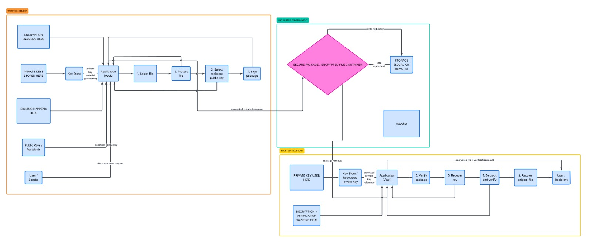

# System Level Design: Secure Digital Document Vault

## 1. System Overview

**Problem Solved:**
Users need to store and share digital documents securely across untrusted infrastructures (such as cloud environments or shared local storage). The system ensures that neither the storage provider nor network attackers can access or alter the file contents.

**Core Features:**
- Local file encryption and protection (Authenticated Encryption).
- Use of digital signatures to guarantee package authenticity and non-repudiation.
- Secure management and storage of cryptographic material within a protected local Key Store.
- Command-line interface (CLI) execution for direct file processing and vault operations.

**Explicitly Out of Scope:**
- Implementation of cryptographic algorithms from scratch (proven schemes via standard Python libraries will be used).
- Digital Rights Management (DRM) once the legitimate "User / Recipient" has recovered and decrypted the file.
- Protection against Denial of Service (DoS) attacks targeting the remote storage server.

## 2. Architecture Diagram

**Diagram Overview:** The architecture strictly isolates cryptographic operations by defining three exact zones:

- **TRUSTED: SENDER** — The local environment where explicitly "ENCRYPTION HAPPENS HERE" and "SIGNING HAPPENS HERE." It contains the CLI "Application (Vault)" and the "Key Store," handling the sequence from file selection (Step 1) to package signing (Step 4).
- **UNTRUSTED ENVIRONMENT** — The transit and rest zone that houses the "SECURE PACKAGE / ENCRYPTED FILE CONTAINER." Here resides the "STORAGE (LOCAL OR REMOTE)" that only reads and writes ciphertext, and it is the environment where an "Attacker" is assumed to be present.
- **TRUSTED: RECIPIENT** — The local environment where explicitly "PRIVATE KEY USED HERE" and "DECRYPTION + VERIFICATION HAPPENS HERE." It covers package validation (Step 5), key recovery, decryption, and delivery of the original file (Steps 6 to 8).

## 3. Security Requirements

- **Confidentiality of file contents:** An attacker who obtains the encrypted container from the "UNTRUSTED ENVIRONMENT" must not be able to learn anything about the file contents without possessing the recipient's protected private key.
- **Integrity of file contents:** Any alteration of the package in the untrusted environment must be mandatorily detected in Step 5 ("Verify package") before attempting decryption.
- **Authenticity of file sender:** The system must prove to the recipient (in Step 7, "Decrypt and verify") that the package irrefutably originates from the claimed sender's public key.
- **Confidentiality of private keys:** The "private key material" must remain immovable within the local Key Store and under no circumstances cross into the untrusted environment.
- **Protection against tampering:** Public information and metadata linked to the file must not be detachable or reassignable by an attacker without invalidating the signature verification.

## 4. Threat Model

**Assets (What must be protected):**

- **File contents:** Requires maximum confidentiality and integrity (protection steps 1 and 2).
- **Private keys:** Requires critical confidentiality; stored exclusively in trusted environments (Key Store).
- **User passwords:** Requires critical confidentiality (used to unlock the local Key Store).
- **Signature validity / Metadata:** Requires integrity protection against tampering and forgery.

**Adversaries (Who are you defending against):**

- **Malicious Storage Provider:** The administrator of the "STORAGE" who has read access to all stored encrypted containers.
- **Network Attacker:** An adversary capable of intercepting the signed and encrypted package while in transit through the "UNTRUSTED ENVIRONMENT."
- **Attacker with temporary local access:** An attacker who gains physical access to a powered-off device and attempts to extract the protected Key Store.

**Attacker Capabilities:**

- **Attackers CAN:** Read the ciphertext, delete or alter the package in the untrusted environment, attempt offline brute-force attacks on the Key Store, and analyze exposed public metadata.
- **Attackers CANNOT:** Access the memory of the application while encryption/decryption processes are running in the Trusted zones, nor mathematically reverse standard cryptographic primitives without the key.

## 5. Trust Assumptions

- **Trusted Senders and Recipients:** It is assumed that users' operating systems are free of malware or keyloggers capable of extracting plaintext keys directly from memory.
- **Authentic Public Keys:** It is assumed that the process where the application obtains the "recipient public key" uses a secure and reliable mechanism to prevent identity spoofing.
- **Secure Randomness:** It is assumed that the local operating system provides a cryptographically secure source of entropy (CSPRNG) for generating keys, IVs, and nonces.
- **Untrusted Central Infrastructure:** It is explicitly assumed that the "UNTRUSTED ENVIRONMENT" (including the network and central storage) is completely compromised and provides no native privacy or data retention guarantees.

## 6. Attack Surface Review

| Entry Point / Interface | What could go wrong? | Security Property at Risk | Design Constraint |
|---|---|---|---|
| CLI / Application Input | Malformed inputs when selecting a file ("Select file"), resulting in buffer overflow vulnerabilities. | System Integrity | Strict validation of paths and inputs in the application code. |
| Package Retrieval (Read Ciphertext) | The storage delivers an old or corrupted package to the "TRUSTED: RECIPIENT" (Replay attack). | Data Integrity / Freshness | Inclusion of timestamps or nonces validated during verification. |
| Key Store Access | Brute-force attacks against the "protected private key reference." | Key Confidentiality | Use of robust key derivation functions (e.g., Argon2id) and strong passwords. |
| Signature Verification (Step 5) | An attacker separates the signature from a valid document and attaches it to a malicious one, causing the receiver to accept it. | Authenticity / Non-repudiation | The digital signature must be calculated over the entire package and its intrinsic metadata. |

## 7. CLI Interface Proposal

To operate the vault in alignment with the architectural diagram, the system will expose the following console commands:

1. **`generate-keys`**: Creates the "private key material" and secures it in the local Key Store using a user-provided password.
2. **`encrypt`**: Executes steps 1 to 4 ("Protect file", "Select recipient public key", "Sign package"). Takes a local file, applies hybrid encryption, and generates the secure package to be sent to storage.
3. **`decrypt`**: Executes steps 5 to 8 ("Verify package", "Recover key", "Decrypt and verify"). Requires the recipient's password to unlock the Key Store, processes the encrypted container, and returns the original file in plaintext.
